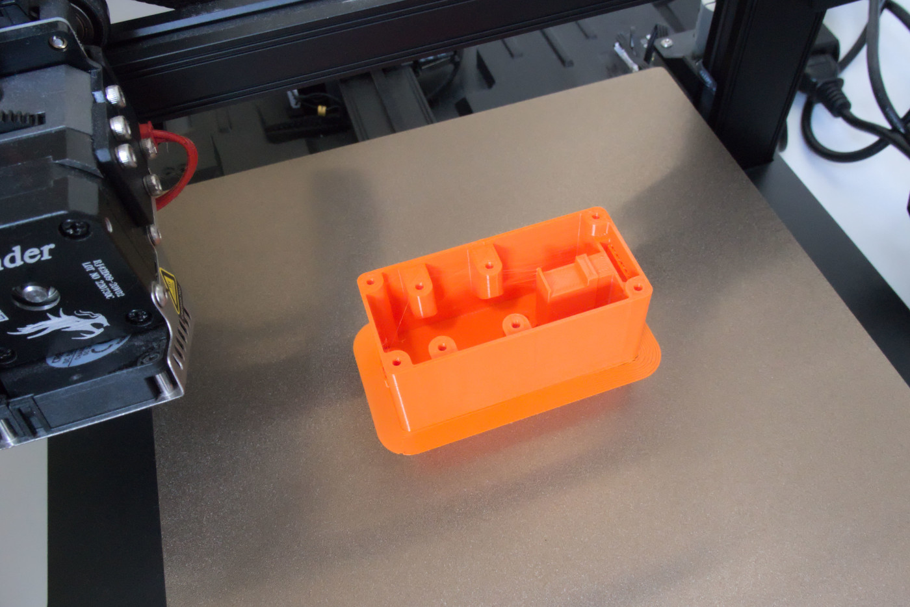
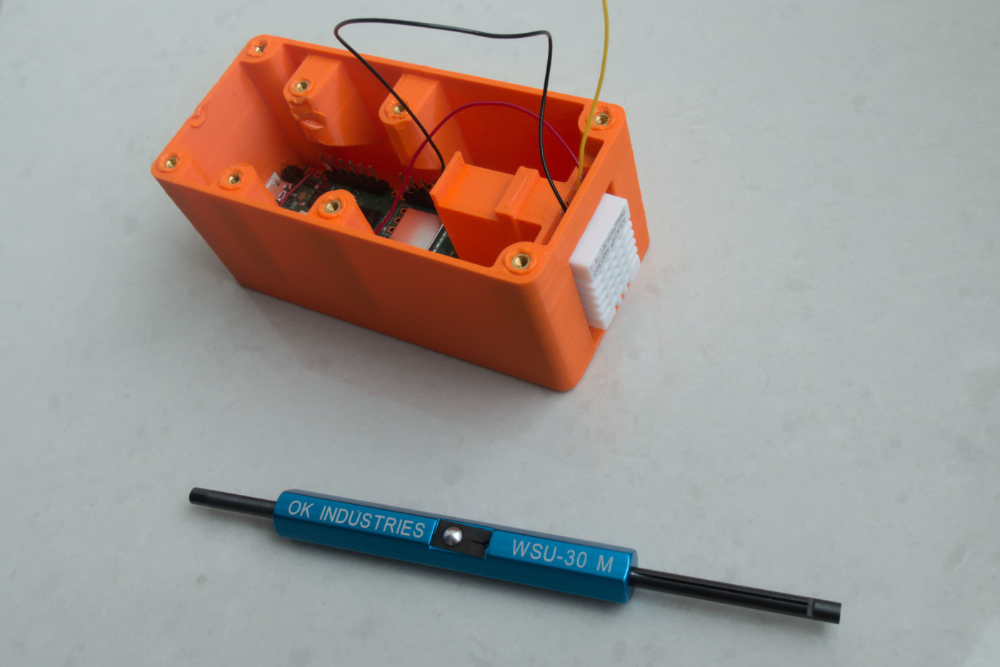
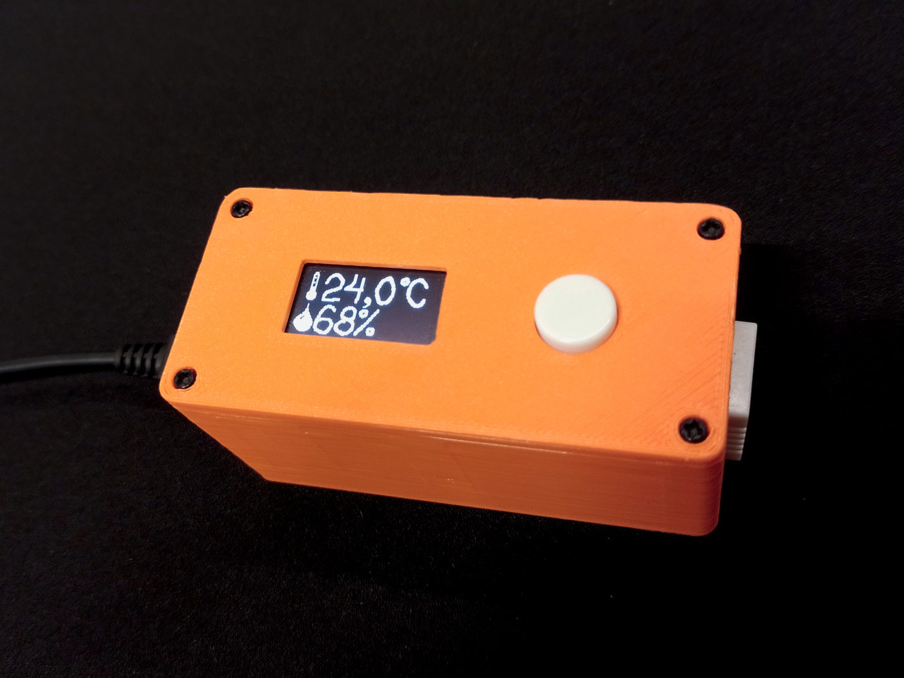

# Temperature and Humidity Sensor

Li'l device measuring the temperature and humidity.

## Hardware

I'm using a 0.01µF (labeled "103") ceramic capacitor in parallel with my switch
to debounce it, and it seems to work well-enough. A 0.1µF one (labeled "104")
also seems to do fine, for that matter.

## Case

[Design in OnShape](https://cad.onshape.com/documents/e987645894743680e4f71a9c/w/7ab77c4f7e5b5df48522bfbd/e/d8782f551b3195f70bd8c6d7).

.")

Some notable slicing settings I used:

* Infill Density: 25%
* Extra Infill Wall Count: 3 [for thicker walls around the insertion screws]
* In the first case I printed, I force-added supports under the "pillars" that
  hold the display. For the second print I didn't, and it still worked very
  well. (Those are on a 45° angle, which everyone says is fine -- now I
  believe everyone!)
